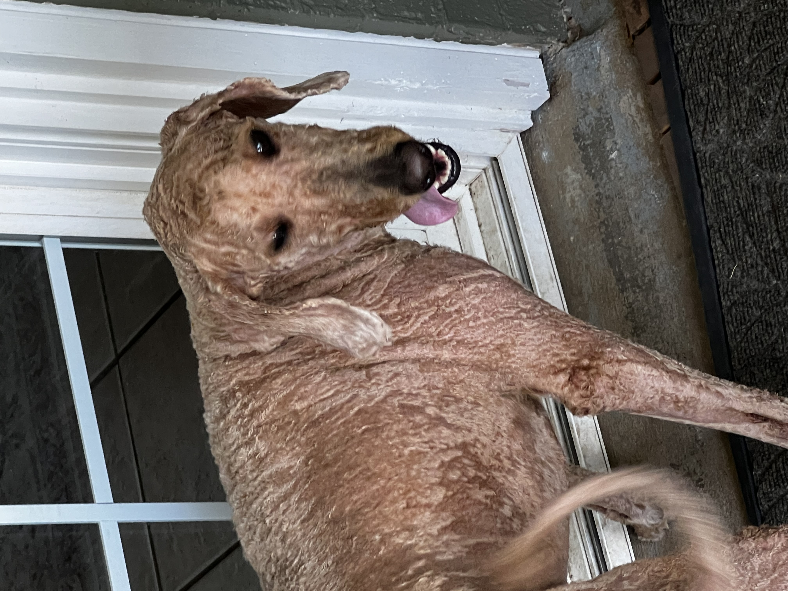
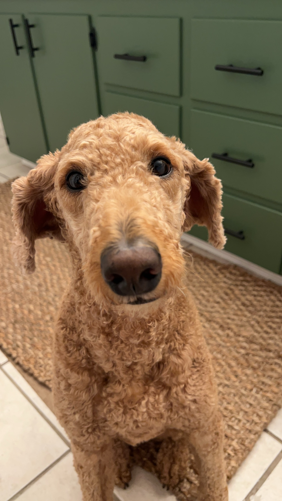

<html lang="en">
<head>
    <meta charset="UTF-8">
    <meta name="viewport" content="width=device-width, initial-scale=1.0">
    <title>Welcome to Our Home</title>
    <!-- Google Fonts and FontAwesome -->
    <link href="https://fonts.googleapis.com/css2?family=Bodoni+Moda:wght@400;600&family=Open+Sans:wght@400;600&display=swap" rel="stylesheet">
    <link rel="stylesheet" href="https://cdnjs.cloudflare.com/ajax/libs/font-awesome/6.0.0-beta3/css/all.min.css">
    
</head>
<body>
    <header>
        <h1>Welcome to Our Home</h1>
        
We’re so glad to have you here. Click on the icons for quick navigation.

        

            <a href="http://192.168.68.151:8123" target="_blank">
                Smart Home Control
            </a>
        

    </header>

    <!-- Photo Gallery Rotating Slideshow -->
    

        

            
        

        

            
        

        

            
        

        <a class="prev" onclick="plusSlides(-1)">&#10094;</a>
        <a class="next" onclick="plusSlides(1)">&#10095;</a>
    

    

        
        
        
    

    <!-- Weather Widget -->
    

        <i class="fas fa-cloud-sun"></i>
        

            
Loading weather data...

        

        

    

    <!-- Search Bar -->
    

        <input type="text" id="search-input" placeholder="Search for a section..." aria-label="Search for a section">
        <button onclick="searchSections()">Search</button>
    

    

    <!-- Example Section -->
    

        <h2>
            <i class="fas fa-tv"></i> Appliances & Devices
            <button class="toggle-btn" onclick="toggleSection(this, 'appliances')" aria-label="Toggle section">
                <i class="fas fa-chevron-down"></i>
            </button>
        </h2>
        

            <ul>
                <li><strong>Thermostat:</strong> Don’t Touch.</li>
                <li><strong>Smart TV:</strong> YouTube TV, Hulu, Netflix, Disney, Prime Video.</li>
                <li>
                    <strong>Washer/Dryer:</strong> Use the AI Opti Wash & Dry Setting. Detergent is automatically dispensed. Clean filter before use.
                    <a href="#lint-filter-cleaning" style="margin-left: 5px;">See Lint Filter Cleaning Instructions</a>
                </li>
            </ul>
        

    

    
    

    <!-- Nespresso Coffee Preparation Guide -->
    

        <h2>
            <i class="fas fa-coffee"></i> Nespresso Coffee Preparation Guide
            <button class="toggle-btn" onclick="toggleSection(this)">
                <i class="fas fa-chevron-down"></i>
            </button>
        </h2>
        

            <ol>
                
<strong>Note:</strong> Capsules are to the left in the jar. The automatic motor raises and lowers the machine's head when the lever is pushed up or down.

                <li>Fill the water tank with fresh drinking water.</li>
                
                <li>Turn on the machine by pressing the button.</li>
                
                <li>GREEN lights will blink while the machine is heating up.</li>
                
                <li>Steady GREEN light indicates the machine is ready.</li>
                
                <li>Place a cup under the coffee outlet.</li>
                
                <li>Open the machine head by pushing the lever up.</li>
                
                <li>Insert a capsule, dome side down.</li>
                <li>Close the lid by pressing the lever down, then press the button to start brewing.</li>
            </ol>
        

    

    

    <!-- Lint Filter Cleaning Instructions -->
    

        <h2>
            <i class="fas fa-filter"></i> Lint Filter Cleaning Instructions
            <button class="toggle-btn" onclick="toggleSection(this)">
                <i class="fas fa-chevron-down"></i>
            </button>
        </h2>
        

            <ol>
                <li>Open the lint filter cover and pull out the lint filter.</li>
                
                <li>Avoid removing the rubber seal on the filter.</li>
                
                <li>Separate the outer and inner filters.</li>
                
                <li>Remove lint from both filters.</li>
                <li>Reassemble the filters and insert them back in place.</li>
            </ol>
        

    

    

    <!-- Guide to Local Bars and Restaurants -->
    

        <h2>
            <i class="fas fa-utensils"></i> Guide to Local Bars and Restaurants
            <button class="toggle-btn" onclick="toggleSection(this)" aria-label="Toggle section">
                <i class="fas fa-chevron-down"></i>
            </button>
        </h2>
        

            <ul>
                <li>
                    <strong>GreenHouse Restaurant and Bar</strong> 
                    Enjoy New American cuisine and an award-winning bar. 
                    <a href="https://greenhouserestaurantdenton.com/" target="_blank">Visit Website</a>
                </li>
                <li>
                    <strong>Rooster's Roadhouse</strong> 
                    Casual BBQ and burgers in a relaxed atmosphere. 
                    <a href="https://roosters-roadhouse.com/" target="_blank">Visit Website</a>
                </li>
                <li>
                    <strong>Barley & Board</strong> 
                    A gastropub with craft beers and elevated comfort food. 
                    <a href="https://www.barleyandboard.com/" target="_blank">Visit Website</a>
                </li>
            </ul>
        

    

    

    <!-- Local Attractions -->
    

        <h2>
            <i class="fas fa-map-marker-alt"></i> Local Attractions
            <button class="toggle-btn" onclick="toggleSection(this)" aria-label="Toggle section">
                <i class="fas fa-chevron-down"></i>
            </button>
        </h2>
        

            <ul>
                <li>
                    <strong>Denton Courthouse-on-the-Square Museum</strong> 
                    Learn about local history in this iconic courthouse. 
                    <a href="https://dentoncounty.gov/Departments/Courthouse-on-the-Square" target="_blank">Visit Website</a>
                </li>
                <li>
                    <strong>Ray Roberts Lake State Park</strong> 
                    A haven for nature enthusiasts with hiking, biking, and fishing. 
                    <a href="https://tpwd.texas.gov/state-parks/ray-roberts-lake" target="_blank">Visit Website</a>
                </li>
                <li>
                    <strong>Arts & Jazz Festival</strong> 
                    An annual festival featuring live music, art, and local food. 
                    <a href="https://dentonjazzfest.com/" target="_blank">Visit Website</a>
                </li>
            </ul>
        

    

    

    <!-- Office Storage (Drawers & Cabinets) -->
    

        <h2>
            <i class="fas fa-archive"></i> Office Storage
        </h2>
        

            <button class="drawer-button" onclick="toggleDrawer('left-drawer')">Left Office Drawer</button>
            <button class="drawer-button" onclick="toggleDrawer('right-drawer')">Right Office Drawer</button>
            <button class="drawer-button" onclick="toggleDrawer('left-cabinet')">Left Office Cabinet</button>
            <button class="drawer-button" onclick="toggleDrawer('right-cabinet')">Right Office Cabinet</button>
        

        <!-- Left Office Drawer -->
        

            <h3>Left Office Drawer</h3>
            <ul>
                <h4>Writing and Drawing Supplies:</h4>
                <li>Sharpie markers (various colors)</li>
                <li>Ballpoint pens (blue and black)</li>
                <li>Highlighters (multiple colors)</li>
                <h4>Office Supplies:</h4>
                <li>Stapler</li>
                <li>Staples</li>
                <li>Tape dispenser</li>
                <li>Scissors</li>
                <li>Push pins</li>
                <li>Gold paper clips</li>
                <li>Binder clips</li>
                <h4>Small Electronics:</h4>
                <li>Remote control</li>
                <li>SD card</li>
                <h4>Miscellaneous:</h4>
                <li>Small plastic containers for organization</li>
            </ul>
            
        

        <!-- Right Office Drawer -->
        

            <h3>Right Office Drawer</h3>
            <ul>
                <h4>Cables and Chargers:</h4>
                <li>USB, USB-C, and Lightning cables</li>
                <li>HDMI or auxiliary cables</li>
                <li>Power cords</li>
                <li>White power adapters/plugs</li>
                <li>Coiled extension cords</li>
                <h4>Electronic Accessories:</h4>
                <li>USB wall adapters</li>
                <li>Smart plugs or sockets</li>
                <li>Circular wireless charging pad</li>
                <li>Small black hub or adapter</li>
                <h4>Portable Electronics:</h4>
                <li>JBL portable speaker</li>
                <li>Earbuds or headphones</li>
                <li>Small black pouch (likely for accessories)</li>
                <h4>Miscellaneous:</h4>
                <li>Bicycle playing cards (two decks)</li>
                <li>Tape measure (yellow and black)</li>
                <li>Roll of electrical or duct tape</li>
                <li>Cylindrical containers (likely for spare parts)</li>
            </ul>
            
        

        <!-- Left Office Cabinet -->
        

            <h3>Left Office Cabinet</h3>
            <ul>
                <h4>Top Shelf:</h4>
                <li>Woven basket (contains small items)</li>
                <li>Aerosol can (possibly compressed air or cleaner)</li>
                <li>Stacked black trays or storage cases</li>
                <li>White boxes (likely empty or containing small items)</li>
                <h4>Bottom Shelf:</h4>
                <li><strong>Electronics:</strong> Microprocessor tuner/amplifier</li>
                <li>Charging station (with multiple cables)</li>
                <h4>Cables and Chargers:</h4>
                <li>Tangled/organized cables (USB, power cords)</li>
                <li>Wall adapters</li>
                <h4>Accessories:</h4>
                <li>LIFX smart bulb packaging</li>
                <li>Wicker basket with small items (possibly lenses or tools)</li>
                <li>Soft pouch</li>
                <h4>Miscellaneous:</h4>
                <li>Folded black fabric (with yellow text)</li>
                <li>Paperwork or manuals</li>
            </ul>
            
        

        <!-- Right Office Cabinet -->
        

            <h3>Right Office Cabinet</h3>
            <ul>
                <h4>Networking and Smart Devices:</h4>
                <li>TP-Link Deco Wi-Fi 7 BE10000 (mesh system boxes)</li>
                <li>Circular Deco devices (part of the mesh system)</li>
                <li>Wall-mounted networking hub/access point</li>
                <li>Cables (Ethernet and power)</li>
                <h4>Large Electronics:</h4>
                <li>Projector or similar device (silver-gray with vents and cables)</li>
                <h4>Gaming Supplies:</h4>
                <li>Stacked board games:</li>
                <ul>
                    <li>Monopoly Builder</li>
                    <li>Out of Line</li>
                    <li>500-piece puzzles</li>
                </ul>
                <li>Two gaming controllers (black and white)</li>
                <li>Charging dock for controllers</li>
                <h4>Miscellaneous:</h4>
                <li>ANEXT cardboard box (possibly for accessories)</li>
                <li>Clear pump bottles (cleaning solution or sanitizer)</li>
            </ul>
            
        

    

    
</body>
</html>
